# Jarkom-Modul-1-D17-2023
Perkenalkan kami dari kelas ``Jaringan Komputer D Kelompok  D17``, dengan Anggota sebagai berikut:

| Nama                      | NRP        |
|---------------------------|------------|
|Adam Haidar Azizi          | 5025211114 |
|Ahda Filza Ghaffaru        | 5025211144 |

## No. 1

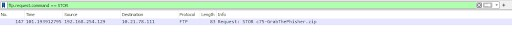
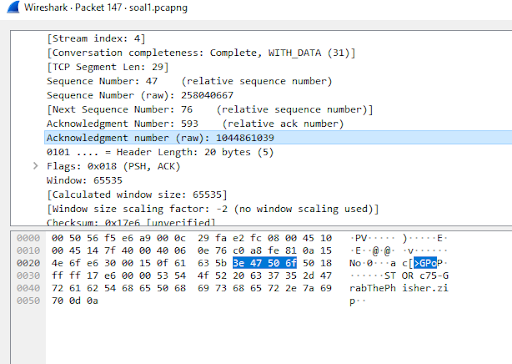
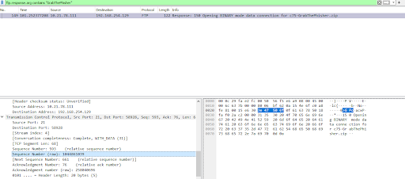

### Penjelasan Nomor 1:
**User melakukan berbagai aktivitas dengan menggunakan protokol FTP. Salah satunya adalah mengunggah suatu file.**

**A.  Berapakah sequence number (raw) pada packet yang menunjukkan aktivitas tersebut?**

Dari soal yang diberikan, kita tahu bahwa protokol yang digunakan adalah FTP dan aktivitas yang digunakan adalah mengunggah file. Karena terjadinya aktivitas upload file, maka server akan merequest dan membaca konten apa saja yang berada di file yang akan di upload, yakni melalui command STOR. Nah, maka dari itu untuk filtering-nya kita hanya perlu menggunakan 

```ftp.request.command == "STOR"```

sehingga packet yang merekam aktivitas upload file dapat dilihat sebagaimana pada gambar 1.

Karena pertanyaannya adalah berapa sequence number (raw) pada packet itu, maka kita hanya perlu membuka packet dan navigasi ke bagian Transmission Control Protocol (sebagaimana pada gambar 2) dan lihat jawabannya.

```Your answer: 258040667```

**B. Berapakah acknowledge number (raw) pada packet yang menunjukkan aktivitas tersebut?**

Sama hal-nya untuk mencari acknowledge number (raw) nya yaitu dengan cara buka packet yang sama dan navigasi ke bagian Transmission Control Protocol dan nilai acknowledge number (raw) nya berada beberapa baris setelah sequence number.

```Your answer: 1044861039```

**C. Berapakah sequence number (raw) pada packet yang menunjukkan response dari aktivitas tersebut?**

Sementara itu, untuk melihat response dari aktivitas tersebut, disini saya melakukan filtering ftp dengan menggunakan nama file zip yang tadi ditemukan untuk soal a dan b, yakni GrabThePhisher. Oleh karena itu, untuk filtering kita perlu untuk menulis

```ftp.response.arg contains "GrabThePhisher"```

Sehingga kita dapat hasil packet untuk response aktivitas tersebut. Dari sini kita bisa membuka packetnya dan melihat sequence number (raw) nya dengan cara yang sama dengan soal sebelumnya.

```Your answer: 1044861039```

**D. Berapakah acknowledge number (raw) pada packet yang menunjukkan response dari aktivitas tersebut?**

Untuk soal D juga sama, dari hasil packet yang didapat di soal C, kita hanya perlu melihat beberapa baris dibawah sequence number (raw) dan kita mendapatkan hasil acknowledge number (raw) nya.

```
Your answer: 258040696

Correct answer!
Correct answers, you are good at addressing!
Here is your flag: Jarkom2023{y0u_r_g00d_4t_4dr3ssing_LrMwEsI60672593}
```

## No. 2

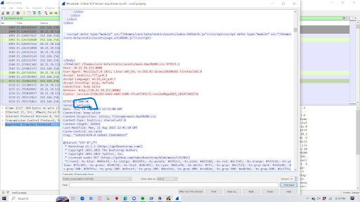

### Penjelasan Nomor 2
**Sebutkan web server yang digunakan pada portal praktikum Jaringan Komputer!**

Your answer: gunicorn

Correct answer!

Here is your flag: Jarkom2023{9unic0rn_1s_aH7s2eeJ7Nv690E_c00l}

## No. 3
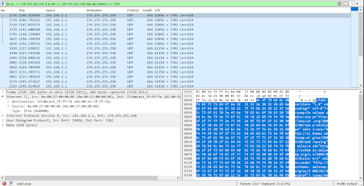

### Penjelasan Nomor 3

**Dapin sedang belajar analisis jaringan. Bantulah Dapin untuk mengerjakan soal berikut:**

**a. Berapa banyak paket yang tercapture dengan IP source maupun destination address adalah 239.255.255.250 dengan port 3702?**

Untuk soal nomor 3A, cara mencari banyaknya paket dengan ip destination address ``239.255.255.250`` dan port 3702 adalah 

```ip.dst_host == 239.255.255.250 && udp.port == 3702```

sehingga dapat dilihat output packetnya sebagaimana pada gambar diatas. Untuk mencari berapa banyak paket yang tercapture, maka kita hanya perlu melihat dibagian bawah kanan, disana tertulis ``Displayed: 21``

```
Your answer: 21
Correct answer!
```

**b. Protokol layer transport apa yang digunakan?**

Karena tadi kita tahu kalau port 3702 digunakan untuk UDP, maka langsung saja kita jawab.

```
Your answer: UDP
Correct answer!

Correct answers, you are good at analysis!
Here is your flag: Jarkom2023{4nalyz3_is_4749_RwOgSwAmPyC_gr3at}
```

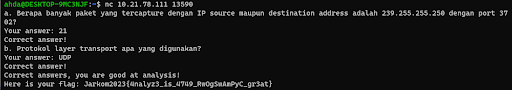

## No. 4


**Berapa nilai checksum yang didapat dari header pada paket nomor 130?**

Untuk menjawab soal nomor 4, kita hanya perlu klik tombol Go to packet pada tab Go dibagian atas wireshark, ketik 130 lalu buka packetnya.

Nilai checksum nya bisa dilihat pada bagian user protocol sebagaimana pada gambar.

```
Your answer: 0x18e5
Correct answer!
Here is your flag: Jarkom2023{ch3cksum_is_u5eful_0xa71m}
```

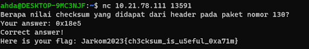

## No. 5
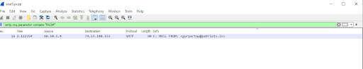
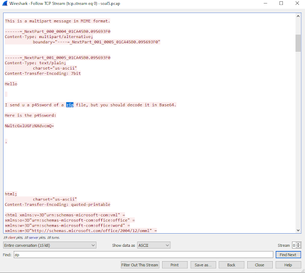
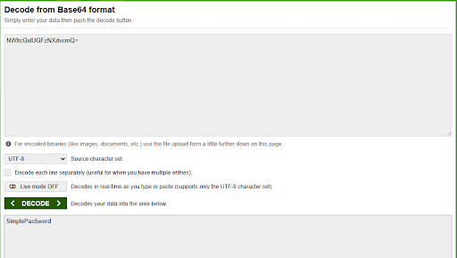
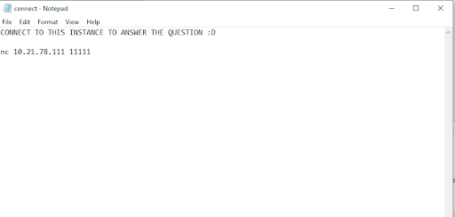
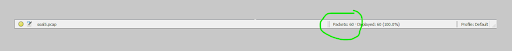

Khusus untuk soal nomor 5, pada platfrom kita tidak diberikan ip untuk menjawab pertanyaan di terminal. Akan tetapi, kita diberikan sebuah file zip yang didalamnya terdapat file txt yang diberikan password. Kami menebak bahwa didalam file tersebut adalah ip yang digunakan untuk menjawab pertanyaan. 

Karena pada soal nomor 5 terdapat soal terkait SMTP disini saya melakukan filtering di wireshark untuk mencari isi dari sebuah email. Sehingga, ketika kita buka file pcap di wireshark, kita mengetikkan

```smtp.req.parameter contains "FROM"```

dapat dilihat bahwa packet muncul dengan informasi email dari seseorang, selanjutnya kita akan klik kanan packet dan follow TCP Stream untuk melihat isi emailnya. 

Setelah di follow, kita akan find kata kunci yakni "zip" dan akan ada sebuah pesan password yang harus di decode dengan Base64. Setelah password di decode melalui website, maka kita akan mendapatkan 

```5implePas5word```

Setelah file zip nya dibuka, kita dapat instance ip nya untuk menjawab pertanyaan.

**a. Berapa banyak packet yang berhasil di capture dari file pcap tersebut?**

untuk mencari berapa paket yang dicapture kita hanya perlu lihat dibagian bawah kanan wireshark tertulis ``Packets: 60``
```
Your answer: 60
Correct answer!
```

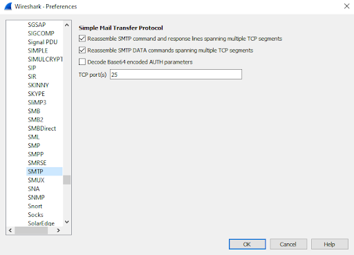

**b. Port berapakah pada server yang digunakan untuk service SMTP?**
Untuk mencari port berapa yang digunakan oleh SMTP, disini saya melakukannya dengan cara navigasi ke tab edit-preferences-Protocols-SMTP. Sehingga tertera bahwa portnya adalah 25 sebagaimana pada gambar.

```
Your answer: 25
Correct answer!
```

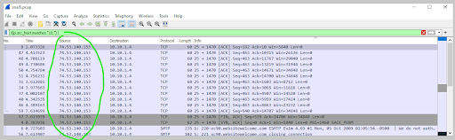

**c. Dari semua alamat IP yang tercapture, IP berapakah yang merupakan public IP?**
Untuk mencari IP berapa yang merupakan publik IP, kita hanya perlu mencari IP yang tidak berawalan 10. sehingga kita hanya perlu melakukan filter dengan cara berikut

```!(ip.src_host matches "10.")```

Sebagaimana hasil packet pada gambar, kita bisa melihat bahwa ip adress yang publik adalah 

```
Your answer: 74.53.140.153
Correct answer!
```

## No. 6 (HASIL REVISI)

**Seorang anak bernama Udin Berteman dengan SlameT yang merupakan seorang penggemar film detektif. sebagai teman yang baik, Ia selalu mengajak slamet untuk bermain valoranT bersama. suatu malam, terjadi sebuah hal yang tak terdUga. ketika udin mereka membuka game tersebut, laptop udin menunjukkan sebuah field text dan Sebuah kode Invalid bertuliskan "server SOURCE ADDRESS 7812 is invalid". ketika ditelusuri di google, hasil pencarian hanya menampilkan a1 e5 u21. jiwa detektif slamet pun bergejolak. bantulah udin dan slamet untuk menemukan solusi kode error tersebut.**

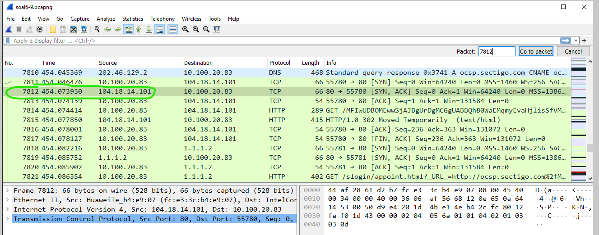

Dari soal tersebut kita memiliki 4 clue,
* Huruf kapital yang digabungkan pada soal menjadi SUBSTITUSI
* Cipher a1z26 yakni mengubah huruf-angka atau angka-huruf
* Rentang huruf A-R, 1-18, 6 huruf
* SOURCE ADRESS adalah clue terbesar.

Dari soal dan clue tersebut, bisa diambil kesimpulan bahwa kita perlu pergi ke packet 7812, ambil source ip nya, dan ubah angka-angkanya menggunakan a1z26. Sehingga didapat hasil ciphernya sebagaimana berikut

```104.18.14.101 --->  10-4-18-14-10-1 ```

didapatkan jawabannya adalah

```JDRNJA```

## No. 7
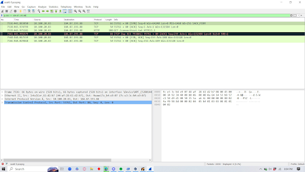
Berapa jumlah packet yang menuju IP 184.87.193.88?

Your answer: 6

Correct answer!

Here is your flag: Jarkom2023{PFAJ5oMj7rFG4013Yp_4n0th3r_f1lt3ring}

## No. 8
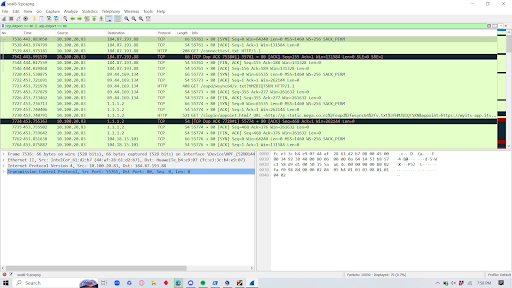
Berikan kueri filter sehingga wireshark hanya mengambil semua protokol paket yang menuju port 80! (Jika terdapat lebih dari 1 port, maka urutkan sesuai dengan abjad)

Your answer: tcp.dstport == 80 || udp.dstport == 80

Correct answer!

## No. 9
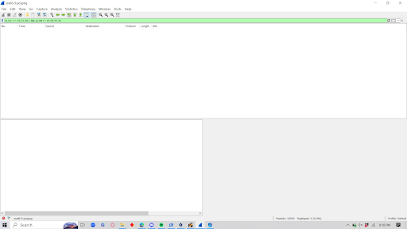
Berikan kueri filter sehingga wireshark hanya mengambil paket yang berasal dari alamat 10.51.40.1 tetapi tidak menuju ke alamat 10.39.55.34!

Your answer: ip.src == 10.51.40.1 && ip.dst != 10.39.55.34

Correct answer!

## No. 10
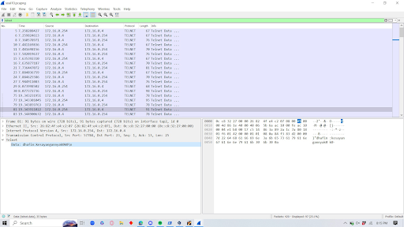
Sebutkan kredensial yang benar ketika user mencoba login menggunakan Telnet, format [username]:[password]!

Your answer: dhafin:kesayangannyak0k0

Correct answer!


